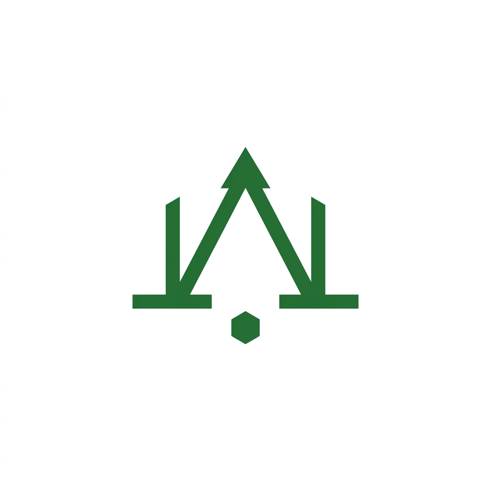

# Week 3: Curate Your Images (Kill Your Darlings)

This document covers the visual assets for my portfolio, matching the content map designed in the Identity Kit. The goal is curation: using real captures for the actual work and maintaining a consistent, restrained style for the connective tissue, while ruthlessly rejecting AI "slop".

---

## 1. The Image Needs List
Matching my content map, my portfolio needs exactly these images:
1. **Hero Texture (Connective Tissue):** A quiet background texture for the landing page hero section.
2. **Favicon (Connective Tissue):** A simple, tiny icon for the browser tab.
3. **Headshot (Real):** A clean, professional photo of myself for the bio section.
4. **Data Contract Case Study (Real Capture):** A legible, cropped screenshot of my `w03_data_contract` Pandas dataframe showing the feature leakage trap.
5. **Task Framing Case Study (Real Capture):** A clean screenshot of my ML-03 task framing Jupyter notebook.

---

## 2. The Final Image Set (The Keepers)

### Keepers: Connective Tissue (Generated)
I used AI to generate these two assets, iterating the prompt to hold a strictly clean, minimalist, dark-green (`#2E7D32`) and near-white (`#FAFAFA`) aesthetic to match my style guide.

**Favicon:**

*(A minimalist data-node logo, symbolizing structured ML work without being distracting).*

**Hero Texture:**

*(A subtle, abstract geometric data gradient providing a quiet frame for the text).*

### Keepers: The Work & The Bio (Real Captures)
For the headshot and the two case study images listed above, I will use **strictly real photos and real screenshots** of my terminal and Jupyter notebooks. 

**Where I chose a real capture over AI:** 
I explicitly chose real, cropped screenshots of my `duckdb` queries and Pandas dataframes over generating fake "dashboard graphics" or "data visualizations" with AI. An engineering manager wants to see the actual code and data structures I worked with, not an AI interpretation of it. Real captures build trust; AI stand-ins for technical work destroy it.

---

## 3. The Rejection Note (Ruthless Curation)

To practice discernment, I generated the following image with the prompt: *"An AI-themed image representing my machine learning models."*

**The Rejected Image:**

**Why I rejected it:**
> I rejected this image because it is generic "AI slop." The glowing neon cyber-brain floating in a matrix is overly flashy, cliché, and completely distracts from the grounded, practical analytics work I actually did on the FlyRank dataset. If my design is the most memorable thing on the page, something is backwards. This image steals attention rather than framing the work.
