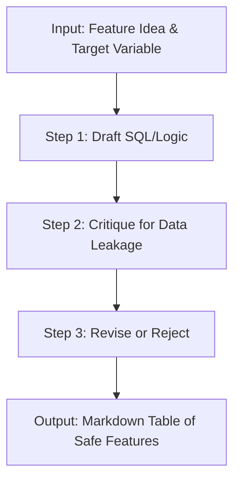

# FL-04: Ship an Automation Workflow (v2)

**Pipeline Name:** The ML Leak-Guard Reviewer
**Tool Used:** Claude Project / Custom AI Prompt Chain
**Purpose:** Feature engineering is highly prone to data leakage (using future information to predict past events). Catching this manually requires tedious cross-referencing of schemas. This workflow automates the drafting and critique of new feature ideas.

---

## 1. The Step Diagram

---

## 2. The Configuration / Prompt Chain
I built this workflow by feeding the following System Prompt into a Claude Project context window, forcing a rigid 3-step output for every input it receives.

**The Prompt:**
> You are the 'ML Leak-Guard Reviewer'. For every feature idea I give you, you must execute the following 3 steps sequentially:
> **Step 1 (Draft):** Write a brief pseudo-SQL definition of how to build this feature.
> **Step 2 (Critique):** Act as a ruthless Data Scientist. Attack the feature definition specifically looking for two things: 'Future-Window Leakage' (using data that wouldn't be available at prediction time) and 'Target-Label Leakage' (accidentally including the answer in the feature).
> **Step 3 (Revise/Reject):** If the feature leaks, attempt to revise it to be completely historically safe. If it cannot be saved, label it 'REJECTED'. Output the final result in a markdown table.

---

## 3. The 5 Real Runs

### Run 1
- **Input:** Use `gsc_impressions` to predict traffic decay for the current month.
- **Output:** 
  - *Critique:* FATAL LEAKAGE. You cannot use the current month's impressions to predict the current month's decay. That data isn't known until the month is over.
  - *Revision:* Use `gsc_impressions_lag_1_month` (the previous month's impressions).

### Run 2
- **Input:** Use `days_since_update` (calculated from `dim_content.content_updated_date`) to predict if a page needs a refresh.
- **Output:** 
  - *Critique:* SAFE. `content_updated_date` is historically static and known at prediction time.
  - *Revision:* None needed. Approved.

### Run 3
- **Input:** Use `gsc_avg_position` from the same month to predict clicks.
- **Output:**
  - *Critique:* TARGET LEAKAGE. Clicks and average position are highly correlated and generated simultaneously. Knowing the position effectively gives away the clicks.
  - *Revision:* REJECTED as a predictive feature. (Can only be used in descriptive analytics).

### Run 4
- **Input:** Use `content_age` (Current Date - `published_date`) to predict search volume.
- **Output:**
  - *Critique:* SAFE. Published date is static and known.
  - *Revision:* None needed. Approved.

### Run 5
- **Input:** Use `is_declining_label` as an input feature for the predictive model.
- **Output:**
  - *Critique:* FATAL LEAKAGE. `is_declining_label` is the exact target variable we are trying to predict. Using it as a feature guarantees 100% accuracy in training and 0% accuracy in production.
  - *Revision:* REJECTED. Remove completely from training features.

---

## 4. Time Accounting & Savings
- **Manual Time:** Mentally tracing schemas, checking temporal relationships, and documenting the risk for 5 features takes me roughly **15 minutes per feature (75 minutes total)**.
- **Workflow Time:** Running this prompt chain takes about **1 minute per feature (5 minutes total)**.
- **Time Saved:** **70 minutes** per brainstorming session. Over a 3-month ML build phase, this easily saves dozens of hours.

---

## 5. Known Failure Points & Required Human Checks
- **Hallucinated Columns:** The AI sometimes suggests "lagging" a column that doesn't actually exist in the database (e.g. `gsc_impressions_lag_1_month`). A human must still write the actual SQL window functions to create those lags.
- **Context Blindness:** The AI doesn't know if a column was retroactively overwritten in the data warehouse. A human engineer still needs to verify that the ETL pipeline doesn't mutate historical rows, which would introduce leakage the AI cannot see.
